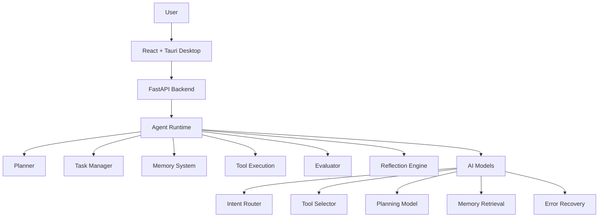

# Veyron

> A modular autonomous operating layer combining deterministic planning, memory retrieval, local intelligence models, and controlled tool execution.

## Overview

Veyron is a local-first agent runtime that combines a ReAct AI core with sandboxed tool execution, hybrid memory, micro-model intelligence, and a desktop user interface. It operates as an intelligent layer between users and their systems — understanding requests, planning multi-step work, executing tools under security policies, and learning from every interaction.

The system exists to provide a professional-grade, private, local AI operating layer that does not rely on cloud services. By running entirely offline via Ollama and local micro-models, Veyron ensures data sovereignty while still delivering autonomous task execution with planning, memory, and security.

Veyron solves the problem of autonomous task execution on local systems with enterprise-grade security, persistent memory, and adaptive planning. It decomposes complex goals into DAG-based execution plans, routes sub-tasks through sandboxed tools gated by security policies, reflects on outcomes to improve future performance, and continuously retrains its micro-models through an active learning pipeline.

## Features

- Autonomous task execution from natural language goals
- DAG-based planning engine with adaptive re-planning
- Hybrid memory system (keyword + importance + recency)
- 5 local intelligence micro-models (intent, tool selection, planning, memory retrieval, error recovery)
- Sandboxed tool execution with security policies
- Real-time desktop application (React + Tauri)
- WebSocket-based live monitoring
- Plugin SDK for extensibility
- Workflow engine for reusable automation
- Comprehensive test suite (880+ tests)

## Architecture



## Screenshots

> Screenshots and demo GIF coming soon. See [assets/](assets/) for details.


*Main dashboard — system overview, task management, and AI agent workspace.*

## Installation

### End Users

Download the latest installer from the [GitHub Releases](https://github.com/hichemuuus/Veyron/releases) page:

1. Download `Veyron_X.Y.Z_x64-setup.exe`
2. Run the installer (no admin required — installs to `%LOCALAPPDATA%/Veyron/`)
3. Launch Veyron from the Start Menu or desktop shortcut
4. The application checks for updates automatically

**Requirements:** Windows 10/11 64-bit, Ollama (optional for local LLM), 4GB+ RAM.

### Developers

```bash
# Backend
uv sync
cp config.example.yaml config.yaml
uv run uvicorn veyron.main:app --reload

# Frontend (browser only)
cd frontend
npm install
npm run dev

# Desktop (Tauri)
npm run tauri:dev
```

### Production Build
See [BUILD.md](BUILD.md) and [INSTALLATION.md](docs/INSTALLATION.md).

## Demo

Describe a goal in natural language, and Veyron handles the rest:

> *"Find large files on my desktop, summarize what they contain, and create a report."*

Veyron will:
1. Plan the multi-step task
2. Execute tools (file search, analysis, summarization)
3. Verify each result
4. Present a final report

See [docs/DEMO.md](docs/DEMO.md) for more examples.

## Configuration

See [config.example.yaml](config.example.yaml) for all options.

## Documentation

- [Architecture](docs/ARCHITECTURE.md)
- [Installation](docs/INSTALLATION.md)
- [Building](BUILD.md)
- [Contributing](CONTRIBUTING.md)
- [Testing](docs/TESTING.md)
- [AI Models](docs/AI_MODELS.md)
- [Design Decisions](docs/DESIGN_DECISIONS.md)
- [Development History](docs/DEVELOPMENT_HISTORY.md)
- [Troubleshooting](docs/TROUBLESHOOTING.md)
- [API Reference](docs/ARCHITECTURE.md#api)

## Project Status

**v1.0.0** — First public release. Production-ready.

- **Release**: [github.com/hichemuuus/Veyron/releases](https://github.com/hichemuuus/Veyron/releases)
- **Changelog**: [CHANGELOG.md](CHANGELOG.md)
- **License**: MIT

Updates are delivered automatically via the built-in updater.

## License

MIT License -- see [LICENSE](LICENSE).
